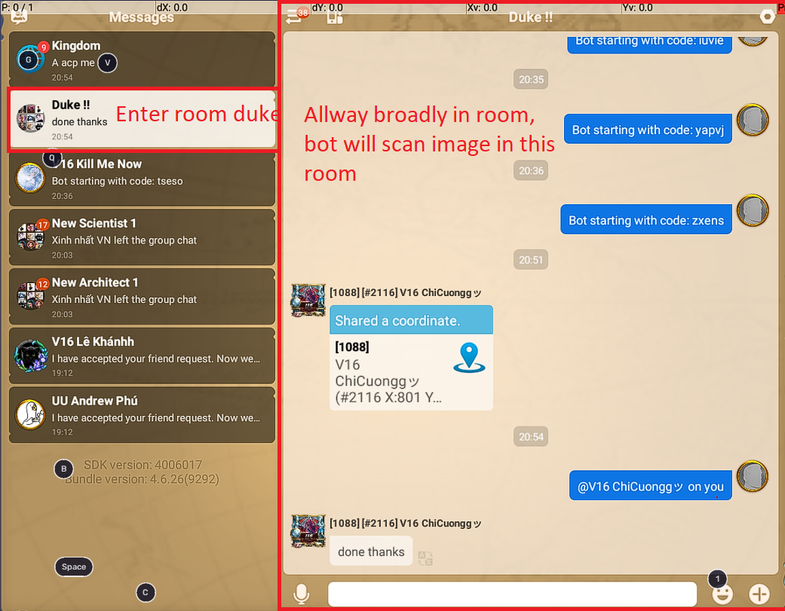

# Giver title for rise of kingdom

Using python and OCR.


## Installation

Install my-project with git command line

```bash
  git clone https://github.com/Ily-1606/Rok-BotgiverTitle.git
  cd Rok-BotgiverTitle
```
1) Install tesseract.exe in this folder
2) Change tesseract_cmd in file detection.py with path you just installed program in step 1
3) Install python (I'm using python 3.9 in this project)    
4) Using bluestack, and in bluestack open Setting->Advanced. Turn on Android debug bridge
5) Start adb server with command line:
```bash
    adb.exe start-server
```  
6) Open Rise Of Kingdom, and broadly chat room.
    - Because #2116 using 3 rooms for 3 titles (duke, architect, scientist). Current, bot only support duke title, should we need enter in room duke, if not, bot automatic using duke as default.
    - Please see image below:
    
7) Run dectection.py with command line (please install python before there)
```bash
    python dectection.py
```
- Done, you can buy coffie, eat some food and watch it automatic.
- Current, I'm only support Duke title, please wait for next version.


## Documentation

1) I'm using current config in bluestack: 
  - Resolution: 1600x900 (Recommend)
2) I'm using current config in Rise Of Kingdom:
    - Graphic: lowest (for lowest RAM)

## Appendix

You can join in attribute with me

Contact to me:
- [Facebook](https://www.facebook.com/Ily1606)
- Gmail: (khuonmatdangthuong45@gmail.com)

  
